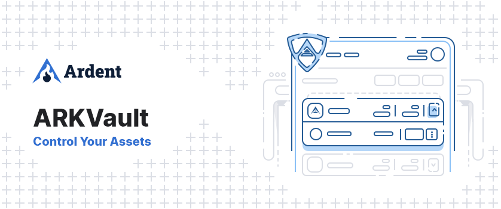

# ARK Vault



[](https://github.com/ArdentHQ/arkvault/actions?query=branch%3Adevelop)
[](https://github.com/ArdentHQ/arkvault/releases)

ARK Vault is a custom web-based wallet designed for ARK Core-based blockchains. It provides real-time updates and can be accessed from any internet-connected device. With Ledger support, ARK Vault ensures the utmost security for your assets.

## Development

### Requirements

#### Node 20.12.2 (LTS)

To download, head over to [here](https://nodejs.org/en/) and download Node 20.12.2.

If you already have npm installed, you can run

```
npm install -g n
sudo n 20.12.2
```

#### pnpm

Install the pnpm dependency manager

```
npm install -g pnpm
```

### Commands

<details><summary>List of commands</summary>

```bash
# Install dependencies
pnpm install

# Execute the application. Making changes in the code, updates the application (hot reloading).
pnpm dev

# Runs linter and applies code formatting
pnpm format

# Runs linter over the files
pnpm lint

# Try to automatically fix lint errors
pnpm lint

# Try to automatically fix lint errors
pnpm prettier

# Builds the production code for the react application
pnpm build

# Run the default test switch in default watch mode
pnpm test

# Run unit tests and generate and display the coverage report
pnpm test:coverage
```

</details>

## Security

If you discover a security vulnerability within this package, please send an e-mail to security@ardenthq.com. All security vulnerabilities will be promptly addressed.

## Credits

This project exists thanks to all the people who [contribute](../../contributors).

## License

[CC BY-NC-ND 4.0](LICENSE) © [Ardent](https://ardenthq.com)
